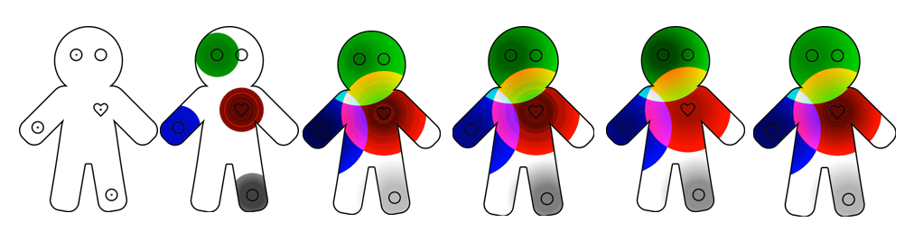

# Animating-Physiological-Signals-for-Deep-Learning

This project propose a technique to perform video classification on ["Gingerbread Animating" videos](https://github.com/RussellYe/Animating-Physiological-Signals-for-Deep-Learning/tree/main/Data%20pre-processing/Low%20resolution%20original%20videos) using PyTorch. A sample frame of the "Gingerbread Animating" video is shown in the figure below. 

**Project Description**

Sample series of frames.png

The Gingerbread_ResNetCRNN.py, ResNetCRNN_check_prediction.py, check_video_predictions.ipynb, functions.py files are implemented based on https://github.com/HHTseng/video-classification
