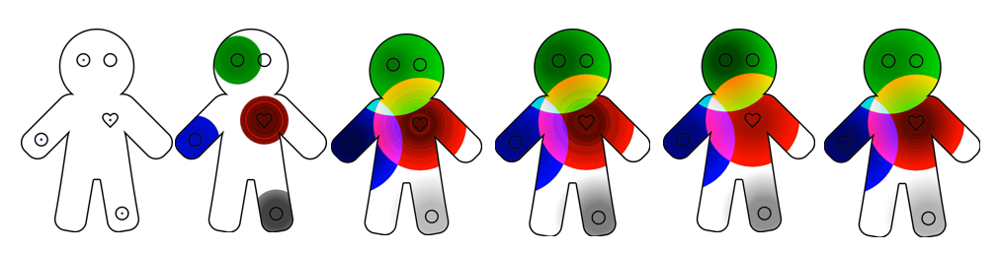

# Animating-Physiological-Signals-for-Deep-Learning

This project propose a technique to perform video classification on ["Gingerbread Animating" videos](https://github.com/RussellYe/Animating-Physiological-Signals-for-Deep-Learning/tree/main/Data%20pre-processing/Low%20resolution%20original%20videos) using PyTorch. 

## Dataset Description

The "Gingerbread Animation" videos dataset is created from an experiment conducted at the ANU Research School of Computer Science. [1] There are two versions of the dataset, including one low-resolution video dataset with 24 low-resolution videos (240p) and a high-resolution video (720p) dataset with only 20 high-resolution videos. There are 24 students participated in the experiment and each of them is required to listen to randomly two types of music (8 pieces of music in total) among three types of music which are classical music, instrumental music and pop music, while the students' physiological signals are recorded during the experiment. Each of the "Gingerbread Animation" video represents each student's physiological data. The low-resolution video dataset is complete and every low-resolution video represents each student's responses in the experiment. For the high-resolution video dataset, the first four students' data is missing so it only contains the data of students from No.4 student to No.24 student. This project will mainly focus on the low-resolution dataset as a proof of concept, and the results generated from the low-resolution dataset should be compared to the high-resolution dataset in the future. 

The videos in both video datasets are in RGB colour and are of the same size and format. There are four types of physiological data recorded in the videos, which are Electrodermal Activity (EDA), Blood Volume Pulse (BVP), Skin Temperature (ST) and Pupil Dilation (PD). [2] Each physiological data is recorded in different frequency, where EDA, BVP, ST and PD signals are recorded by a rate of 4Hz, 64Hz, 4Hz, and 60Hz respectively. [1] Thus, the PD and BVP signals will display in a higher frequency in the video compared to EDA and ST. 

A sample frame of the "Gingerbread Animating" video is shown in the figure below. 




## Project Description

The aim of the project is to predict and classify whether a sequence of frames (like the sequence shown above) from the "Gingerbread Animation" video represents classical music, instrumental music or pop music. In this project, I have implemented a hybrid deep learning model called convolutional recurrent neural network (CRNN) to perform video classification on the "Gingerbread Animation" videos dataset. The CRNN model consists of a convolutional layer with ResNet152 or ResNet-34 pre-trained model and a recurrent layer with Long Short Term Memory (LSTM). 

The core block of code and the architecture of the CRNN model including Gingerbread_ResNetCRNN.py, ResNetCRNN_check_prediction.py, check_video_predictions.ipynb, functions.py files are implemented based on https://github.com/HHTseng/video-classification/tree/master/ResNetCRNN. 

## Environment Used

Python: 3.7.3

PyTorch: 1.4.0

torchvision: 0.5.0

CUDA: 11.0

GPU: Nvidia GTX1660Ti GDDR6 

## Code Running Instructions

### 1. Download or Clone the pre-processed Gingerbread Animation video dataset.

Please initially download or clone this project with the [data_preprocessing](https://github.com/RussellYe/Animating-Physiological-Signals-for-Deep-Learning/tree/main/Data%20pre-processing) folder. The folder [High resolution original videos](https://github.com/RussellYe/Animating-Physiological-Signals-for-Deep-Learning/tree/main/Data%20pre-processing/High%20resolution%20original%20videos) stores the high resolution Gingerbread Animation videos (20 videos), which are not used for training in this project. The folder [Low resolution original videos](https://github.com/RussellYe/Animating-Physiological-Signals-for-Deep-Learning/tree/main/Data%20pre-processing/Low%20resolution%20original%20videos) stores the the low resolution Gingerbread Animation videos (24 videos), which are the original dataset used for training in this project. The folder [Segmentation Info](https://github.com/RussellYe/Animating-Physiological-Signals-for-Deep-Learning/tree/main/Data%20pre-processing/Segmentation%20Info) displays the video segmentation information. The folder [Video cuts collection](https://github.com/RussellYe/Animating-Physiological-Signals-for-Deep-Learning/tree/main/Data%20pre-processing/Video%20cuts%20collection) stores all necessary frames extracted from the original Gingerbread Animation videos. 

### 2. Pre-process Gingerbread Animation videos data
The original Gingerbread video data is in the folder [Low resolution original videos](https://github.com/RussellYe/Animating-Physiological-Signals-for-Deep-Learning/tree/main/Data%20pre-processing/Low%20resolution%20original%20videos). The file [Video_Segmentation.ipynb](https://github.com/RussellYe/Animating-Physiological-Signals-for-Deep-Learning/blob/main/Data%20pre-processing/Video_Segmentation.ipynb) is to process the original video data and divide the videos into 8 segments for each video, and store the video segments in the folder [Video cuts collection/Video Segments/](https://github.com/RussellYe/Animating-Physiological-Signals-for-Deep-Learning/tree/main/Data%20pre-processing/Video%20cuts%20collection/Video%20Segments). Then, the video segments stored in the folder [Video cuts collection/Video Segments/](https://github.com/RussellYe/Animating-Physiological-Signals-for-Deep-Learning/tree/main/Data%20pre-processing/Video%20cuts%20collection/Video%20Segments) is processed by [Frame_extraction_all.ipynb](https://github.com/RussellYe/Animating-Physiological-Signals-for-Deep-Learning/blob/main/Data%20pre-processing/Frame_extraction_all.ipynb) and the output is stored in the folder [/Video cuts collection/Video frames collection/train_all1] and [/Video cuts collection/Video frames collection/train_all2] and [/Video cuts collection/Video frames collection/train_all3]. Finally, the data stored in the folders mentioned above are processed by [Frame_extraction_final.ipynb](https://github.com/RussellYe/Animating-Physiological-Signals-for-Deep-Learning/blob/main/Data%20pre-processing/Frame_extraction_final.ipynb) which will output the dataset used for training which are [/Video cuts collection/Video frames collection/training_split1] and [/Video cuts collection/Video frames collection/training_split2] and [/Video cuts collection/Video frames collection/training_split3]. 

The 1, 2, 3 at the end of the file name indicates the frame extraction method used. For example, training_split3 means this dataset is extracted by the 3-frames-per-second data extraction method, and training_all1 means this dataset is extracted by the 1-frame-per-second data extraction method. Since these folders are too large and hard to upload in Github. Please download them in at https://drive.google.com/file/d/1Zpx9Pzs-Wlp41PR-Ua_CQXk-krFzFp1J/view?usp=sharing. Then put all the folders including train_all1, train_all2, train_all3, training_split1, training_split2 and training_split3 under the directory of Video frames collection. For example, /Video cuts collection/Video frames collection/train_all1. 

The data used for training is stored in training_split1, training_split2, training_split3 folders, which represents the frame extraction method of 1-frame-per-second, 2-frames-per-second and 3-frames-per-second respectively. 

All necessary frames and videos required for training are stored in [Video cuts collection](https://github.com/RussellYe/Animating-Physiological-Signals-for-Deep-Learning/tree/main/Data%20pre-processing/Video%20cuts%20collection) folder, so there is no need to run `Video_Segmentation.ipynb`,`Frame_extraction_all.ipynb`, and `Frame_extraction_final.ipynb` again to get the pre-processed data. If you want to do the data pre-processing again, then just keep the three ipynb files mentioned above and the 
[Data pre-processing/Low resolution original videos](https://github.com/RussellYe/Animating-Physiological-Signals-for-Deep-Learning/tree/main/Data%20pre-processing/Low%20resolution%20original%20videos) folders and delete all other folders. Then, run `Video_Segmentation.ipynb`,`Frame_extraction_all.ipynb`, and `Frame_extraction_final.ipynb` consecutively. After that, you can mannually generate all necessary pre-processed data used for training. 
### 3. Run the CRNN model

There are three files required to run the CRNN model, which are 

  - `Gingerbread_ResNetCRNN.py`: Initialize the model CRNN model parameters, and train/test splitting. 
  - `function.py`: ResNet-152/ResNet-34 CRNN model, data loaders, data transformers. 
  - `3_classes.pkl`: 3 music genres: classical music, instrumental music and pop music. 

For the file `Gingerbread_ResNetCRNN.py`, remember to set up the data pathe and frame extraction methods:

**Data Path**

In the file `Gingerbread_ResNetCRNN.py`, set the data path to  
```
data_path = "Data pre-processing/Video cuts collection/Video frames collection/training_split1/"    # define ginger bread data path
class_name_path = '3_classes.pkl'
save_model_path = "save_model/"
```

**Change the frame extraction methods** 


To change the frame extraction method in terms of frame rate (1-frame-per-second, 2-frames-per-second and 3-frames-per-second), change the end frame parameter shown below:
```
begin_frame, end_frame, skip_frame = 1, 26, 1
```
  - For one-frame-per-second, the end frames are 26/21/13, for 100% frames, 80% frames and 50% frames respectively
  - For two-frames-per-second, the end frames are 52/42/26, for 100% frames, 80% frames and 50% frames respectively
  - For three-frames-per-second, the end frames are 78/63/39, for 100% frames, 80% frames and 50% frames respectively

**To run the code, just run the `Gingerbread_ResNetCRNN.py` in your IDE with the data pre-processing folders, `function.py` file and `3_classes.pkl` file.**

### 4. Model outputs & Evaluation

There are three types of output:

  - The training and test loss and accuracy by epochs of training: `CRNN_epoch_training_losses.npy`, `CRNN_epoch_training_accuracy.npy`, `CRNN_epoch_test_loss.npy` and `CRNN_epoch_test_accuracy.npy`.
  - The plot of training loss vs test loss and the plot of training accuracy vs test accuracy by epochs of training: `fig_Gingerbread_ResNetCRNN.png`. 
  - Temporary model parameters & optimizer in a specific epoch of training: `cnn_encoder_epoch15.pth`, `rnn_decoder_epoch15.pth`, which stores all the parameters of the CRNN in a specific epoch, which can be further used for retrain the model. 
  - `CRNN_epoch_test_loss.npy`, `CRNN_epoch_test_accuracy.npy`, `CRNN_epoch_training_losses.npy` and `CRNN_epoch_training_accuracy.npy`
  
To evaluate the model performance in terms of the whole dataset:
  - `ResNetCRNN_check_prediction.py` is to load the best training model and output a `pkl` file called `Ginger_bread.pkl` which stores all 183 predictions in a dataframe by using the training model produced by a specific epoch. 
  - `check_video_predictions.ipynb` is to show the prediction results by the training model on the whole dataset, including both the training data and test data. 
  - `npy_visualization.ipynb` is to better visualize the relationships between training loss vs test loss, and between training accuracy and test accuracy. 
  
## References 
[1] Rahman, J. S.; Gedeon, T.; Caldwell, S.; Jones, R.; and Jin, Z., 2020. Towards effective music therapy for mental health care using machine learning tools: Human affective reasoning and music genres. Ph.D. thesis. 
[2] Sanchez, J. G., 2017. Electrodermal activity. https://www.sciencedirect.com/topics/psychology/electrodermal-activity.
